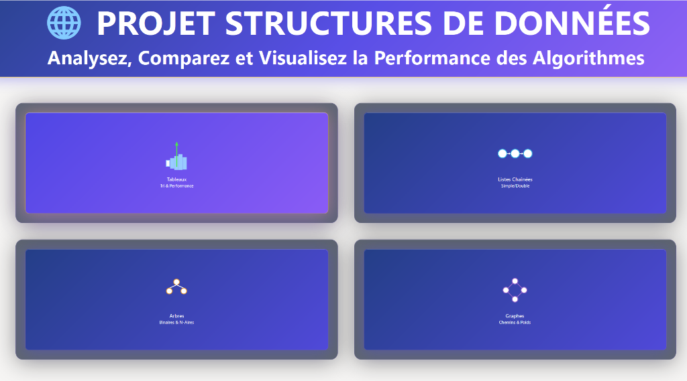
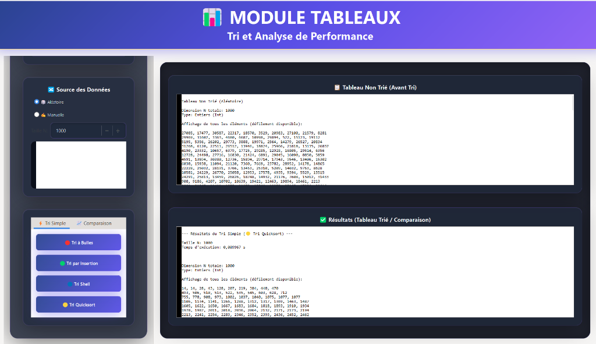
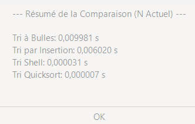
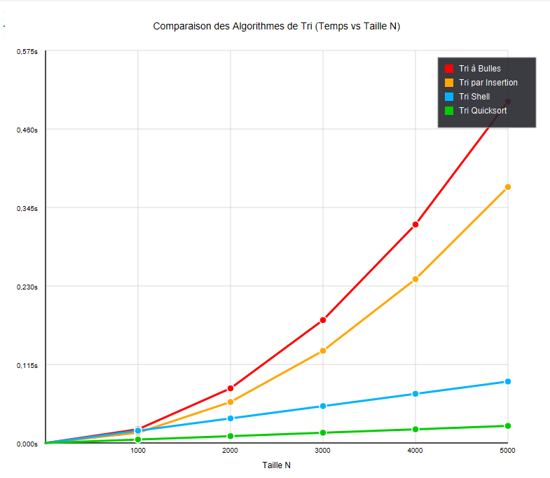
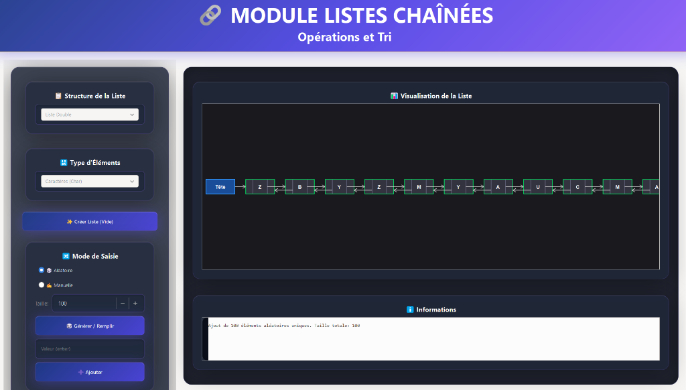
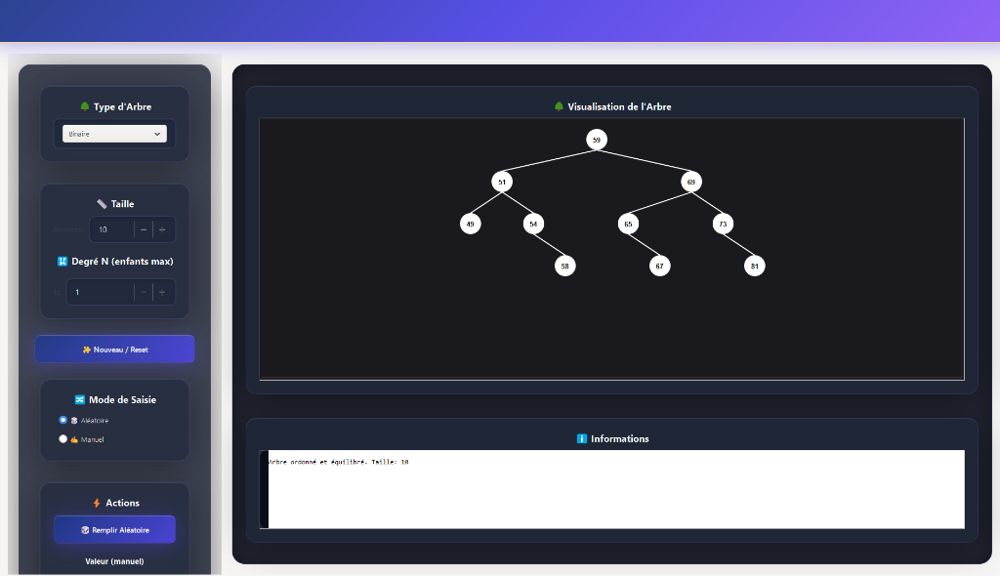
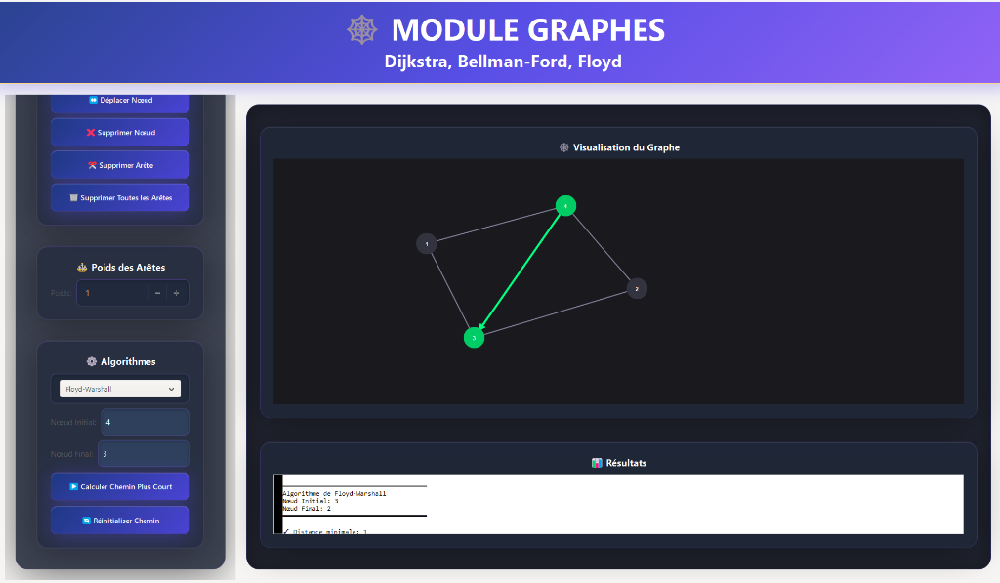

# 📊 Structures de Données et Algorithmes - Application GTK

Une application graphique éducative développée en **C** avec **GTK3** pour visualiser et manipuler les structures de données fondamentales et les algorithmes de tri.


---

## 📖 Description

Cette application a été conçue dans un but **pédagogique** pour :
- Visualiser graphiquement les structures de données
- Comparer les performances des algorithmes de tri
- Manipuler interactivement des listes, arbres et graphes

---

## ✨ Fonctionnalités

### 📋 Module Tableaux
- **Types de données supportés** : Entiers, Réels (Float), Caractères, Chaînes de caractères
- **Génération de données** : Aléatoire ou saisie manuelle
- **Algorithmes de tri implémentés** :
  - Tri à Bulles (Bubble Sort) - O(n²)
  - Tri par Insertion (Insertion Sort) - O(n²)
  - Tri Shell (Shell Sort) - O(n^1.3)
  - Tri Rapide (Quicksort) - O(n log n)
- **Comparaison des performances** avec affichage graphique des courbes

### 🔗 Module Listes Chaînées
- **Liste simple** (pointeur next uniquement)
- **Liste doublement chaînée** (pointeurs next et prev)
- Visualisation graphique des nœuds et connexions
- Opérations : insertion, suppression, recherche

### 🌳 Module Arbres
- **Arbres binaires** (BST - Binary Search Tree)
- **Arbres N-aires** avec degré configurable
- **Parcours** : Préfixe, Infixe, Postfixe, BFS (largeur)
- Transformation N-aire → Binaire (LCRS)
- Visualisation graphique avec Cairo

### 📈 Module Graphes
- **Graphes orientés/non orientés**
- **Graphes pondérés/non pondérés**
- **Représentation** : Matrice d'adjacence
- **Algorithmes** :
  - Parcours en largeur (BFS)
  - Plus court chemin (Dijkstra)
- Interface interactive pour créer/modifier le graphe

---

## 🛠️ Prérequis

### Windows (avec MSYS2)

1. **Installer MSYS2** : [https://www.msys2.org/](https://www.msys2.org/)

2. **Installer les dépendances** (dans le terminal MSYS2 MINGW64) :
   ```bash
   pacman -S mingw-w64-x86_64-gcc
   pacman -S mingw-w64-x86_64-gtk3
   pacman -S mingw-w64-x86_64-pkg-config
   ```

3. **Ajouter au PATH** le dossier `C:\msys64\mingw64\bin`

### Linux (Debian/Ubuntu)
```bash
sudo apt install build-essential libgtk-3-dev
```

---

## 🚀 Compilation

### Avec GCC directement
```bash
gcc main.c -o structures_app $(pkg-config --cflags --libs gtk+-3.0) -lm
```

### Avec Code::Blocks
1. Ouvrir le fichier projet `cc.cbp`
2. Cliquer sur **Build** → **Build and Run**

---

## ▶️ Exécution

```bash
./structures_app
```

Ou sur Windows :
```cmd
structures_app.exe
```

---

## 📁 Structure du Projet

```
.
├── main.c              # Code source principal (7494 lignes)
├── README.md           # Ce fichier
└── cc.cbp              # Fichier projet Code::Blocks (optionnel)
```

---

## 🎯 Utilisation

1. **Lancer l'application** - Une fenêtre principale s'affiche
2. **Choisir le module** souhaité : Tableaux, Listes, Arbres ou Graphes
3. **Configurer les paramètres** : type de données, taille, méthode
4. **Visualiser les résultats** graphiquement

### Exemple : Comparer les algorithmes de tri
1. Aller dans le module **Tableaux**
2. Choisir une taille N (ex: 1000 éléments)
3. Sélectionner le type de données (Entiers)
4. Cliquer sur **Comparer** pour voir les courbes de performance

---

## 🖼️ Captures d'écran

### Page d'Accueil


### Module Tableaux






### Module Listes Chaînées


### Module Arbres


### Module Graphes


---

## 👩‍💻 Auteur

- **rim-coder** - [GitHub](https://github.com/rim-coder)

---

## 📄 Licence

Ce projet est à usage éducatif.

---

## 🙏 Remerciements

- Bibliothèque **GTK3** pour l'interface graphique
- **Cairo** pour le rendu graphique des structures
